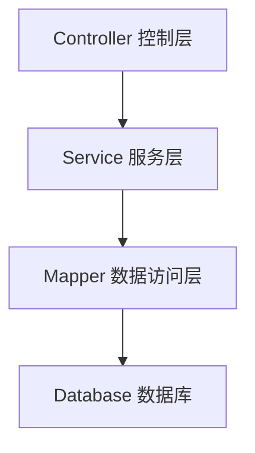
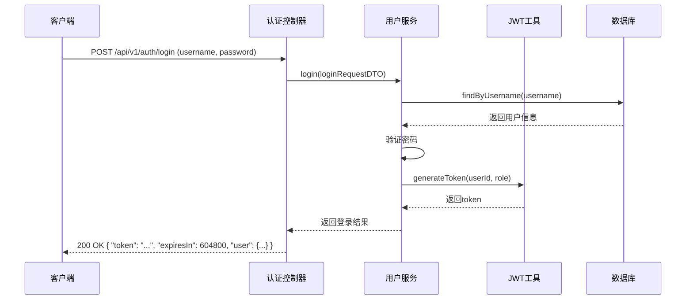
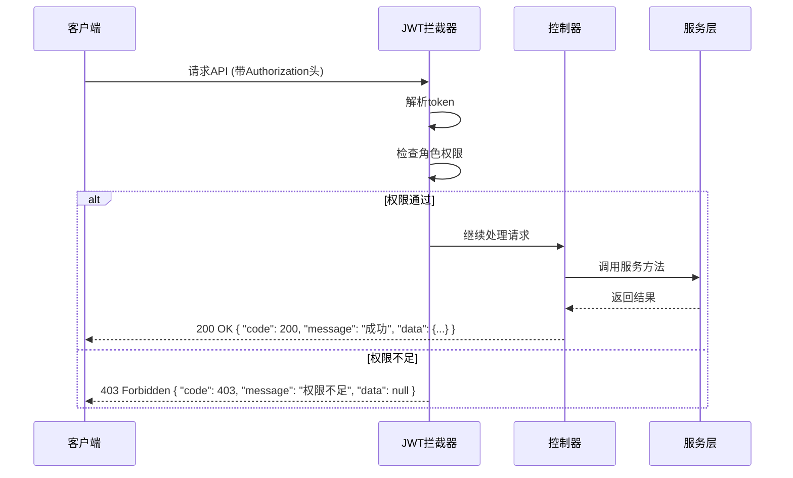

# 同学录管理系统 - 后端架构设计

**版本号：v0.1.0**

> ⚠️ 注意：本项目目前尚未进入正式开发阶段，正处于框架搭建过程中。

## 项目概述
这是一个基于Spring Boot 3 + MyBatis + JWT的同学录管理系统后端框架，采用标准三层架构设计，支持用户认证、班级管理、同学信息管理等核心功能。

## 技术栈

| 类别 | 技术 | 版本 | 用途 |
|------|------|------|------|
| 基础语言 | Java | 17+ | 开发语言 |
| 框架 | Spring Boot | 3.5.10 | 应用框架 |
| 持久层 | MyBatis | 3.5.16 | ORM框架 |
| 数据库 | MySQL | 8.x | 数据存储 |
| 认证 | JWT | 0.12.5 | 无状态认证 |
| 构建工具 | Maven | 3.9.6 | 依赖管理 |
| 代码简化 | Lombok | 1.18.30 | 减少样板代码 |
| 安全 | Spring Security | 6.3.1 | 密码加密 |
| JSON处理 | Jackson | 2.17.2 | JSON序列化/反序列化 |

## 架构设计

### 1. 三层架构



- **控制层（Controller）**：处理HTTP请求，参数校验，调用服务层方法，返回统一响应
- **服务层（Service）**：实现业务逻辑，处理业务规则，调用数据访问层方法
- **数据访问层（Mapper）**：负责数据库操作，执行SQL语句

### 2. 核心流程图

#### 用户认证流程



#### 权限控制流程



## 项目结构

```
src/main/java/com/thirteenash/
├── controller/        # 控制器层
│   ├── AuthController.java       # 认证控制器
│   ├── AdminController.java      # 管理员控制器
│   ├── ClassController.java      # 班级管理控制器
│   └── StudentProfileController.java  # 同学信息控制器
├── service/           # 服务层
│   ├── IUserService.java         # 用户服务接口
│   ├── IClassService.java        # 班级服务接口
│   ├── IStudentProfileService.java  # 同学信息服务接口
│   └── impl/          # 服务层实现
│       ├── UserServiceImpl.java  # 用户服务实现
│       ├── ClassServiceImpl.java # 班级服务实现
│       └── StudentProfileServiceImpl.java  # 同学信息服务实现
├── mapper/            # 数据访问层
│   ├── UserMapper.java            # 用户Mapper
│   ├── ClassMapper.java           # 班级Mapper
│   ├── ClassMemberMapper.java     # 班级成员Mapper
│   └── StudentProfileMapper.java  # 同学信息Mapper
├── entity/            # 实体类
│   ├── User.java                  # 用户实体
│   ├── Clazz.java                 # 班级实体
│   ├── ClassMember.java           # 班级成员关系
│   └── StudentProfile.java        # 同学档案实体
├── dto/               # 数据传输对象
│   ├── LoginRequestDTO.java       # 登录请求
│   ├── RegisterRequestDTO.java    # 注册请求
│   ├── ChangePasswordRequestDTO.java  # 修改密码请求
│   ├── ResetPasswordRequestDTO.java   # 重置密码请求
│   ├── CreateClassRequestDTO.java     # 创建班级请求
│   ├── UpdateClassRequestDTO.java     # 更新班级请求
│   └── AddClassMembersRequestDTO.java # 添加班级成员请求
├── vo/                # 响应对象
│   ├── LoginResponseVO.java       # 登录响应
│   ├── UserInfoVO.java            # 用户信息响应
│   ├── ClassInfoVO.java           # 班级信息响应
│   ├── StudentProfileVO.java      # 同学信息响应
│   └── PageResponse.java          # 分页响应
├── common/            # 公共组件
│   ├── exception/     # 异常处理
│   │   ├── BusinessException.java    # 业务异常
│   │   └── GlobalExceptionHandler.java # 全局异常处理器
│   ├── response/      # 响应封装
│   │   └── Result.java                # 统一响应格式
│   └── util/          # 工具类
│       ├── PasswordUtil.java          # 密码工具
│       └── Constants.java             # 常量定义
├── security/          # 安全相关
│   └── jwt/           # JWT相关
│       └── JwtUtil.java               # JWT工具类
├── interceptor/       # 拦截器
│   └── JwtInterceptor.java           # JWT拦截器
├── annotation/        # 注解
│   └── RequiresRole.java             # 角色权限注解
├── handler/           # 处理器
│   └── JsonTypeHandler.java          # JSON类型处理器
└── config/            # 配置类
    └── WebConfig.java                # Web配置类
```

## 核心功能模块

### 1. 用户认证模块
- 用户注册/登录
- JWT令牌生成与验证
- 密码加密存储
- 修改密码/重置密码

### 2. 班级管理模块
- 创建/更新/删除班级
- 获取班级列表/详情
- 班级成员管理（添加/移除）

### 3. 同学信息管理模块
- 获取同学列表
- 获取同学详情
- 更新同学信息
- 删除同学信息
- 字段级可见性控制

### 4. 权限控制模块
- 基于角色的权限控制（ADMIN/STUDENT）
- JWT拦截器权限检查
- 注解式权限控制

### 5. 统一响应与异常处理
- 统一响应格式：`{"code": 200, "message": "成功", "data": {...}}`
- 全局异常捕获与处理
- 业务异常定义与使用

## 配置说明

### 1. 应用配置（application.yml）

```yaml
server:
  port: 8080

spring:
  datasource:
    url: jdbc:mysql://localhost:3306/classmatehub?useUnicode=true&characterEncoding=utf-8&useSSL=false&serverTimezone=Asia/Shanghai
    username: root
    password: 123456
    driver-class-name: com.mysql.cj.jdbc.Driver

mybatis:
  mapper-locations: classpath:mapper/*.xml
  type-aliases-package: com.thirteenash.entity

jwt:
  secret: classmatehubSecretKey
  expire: 604800 # 7天过期(秒)

logging:
  level:
    com.thirteenash: info
```

### 2. 依赖配置（pom.xml）

核心依赖：
- Spring Boot Starter Web
- Spring Boot Starter MyBatis
- MySQL Connector
- JWT (jjwt-api/impl/jackson)
- Spring Security
- Lombok

## API接口规范

### 1. 路径前缀
所有API接口统一使用 `/api/v1` 作为前缀，例如：
- 认证接口：`/api/v1/auth/*`
- 班级接口：`/api/v1/classes/*`
- 同学信息接口：`/api/v1/students/*`
- 管理员接口：`/api/v1/admin/*`

### 2. 统一响应格式

#### 成功响应

```json
{
  "code": 200,
  "message": "成功",
  "data": {...}
}
```

#### 失败响应

```json
{
  "code": 400,
  "message": "错误信息",
  "data": null
}
```

### 3. 认证方式
- 使用JWT令牌进行认证
- 令牌需要放在请求头的 `Authorization` 字段中
- 格式：`Bearer <token>`

## 数据库设计

### 1. 用户表（user）
| 字段名 | 数据类型 | 描述 |
|-------|---------|------|
| id | BIGINT | 用户ID |
| username | VARCHAR(50) | 用户名 |
| password | VARCHAR(100) | 密码（加密） |
| email | VARCHAR(100) | 邮箱 |
| phone | VARCHAR(20) | 手机号 |
| real_name | VARCHAR(50) | 真实姓名 |
| student_id | VARCHAR(30) | 学号 |
| role | VARCHAR(20) | 角色（ADMIN/STUDENT） |
| avatar | VARCHAR(255) | 头像URL |
| status | VARCHAR(20) | 状态（NORMAL/DISABLED） |
| create_time | DATETIME | 创建时间 |
| update_time | DATETIME | 更新时间 |

### 2. 班级表（clazz）
| 字段名 | 数据类型 | 描述 |
|-------|---------|------|
| id | BIGINT | 班级ID |
| name | VARCHAR(100) | 班级名称 |
| description | TEXT | 班级描述 |
| start_year | INT | 开始年份 |
| end_year | INT | 结束年份 |
| create_time | DATETIME | 创建时间 |
| update_time | DATETIME | 更新时间 |

### 3. 班级成员表（class_member）
| 字段名 | 数据类型 | 描述 |
|-------|---------|------|
| id | BIGINT | 主键ID |
| class_id | BIGINT | 班级ID |
| user_id | BIGINT | 用户ID |
| join_time | DATETIME | 加入时间 |

### 4. 同学档案表（student_profile）
| 字段名 | 数据类型 | 描述 |
|-------|---------|------|
| id | BIGINT | 档案ID |
| user_id | BIGINT | 用户ID |
| basic_info | JSON | 基本信息 |
| contact_info | JSON | 联系信息 |
| education_info | JSON | 教育信息 |
| personal_info | JSON | 个人信息 |
| create_time | DATETIME | 创建时间 |
| update_time | DATETIME | 更新时间 |

## 开发规范

### 1. 命名规范
- 类名：大驼峰命名法（PascalCase）
- 方法名：小驼峰命名法（camelCase）
- 变量名：小驼峰命名法（camelCase）
- 常量名：全大写，下划线分隔（UPPER_CASE）
- 包名：小写，点分隔（lowercase.dot.separated）

### 2. 代码风格
- 使用4个空格缩进
- 方法长度控制在50行以内
- 类长度控制在500行以内
- 合理使用注释，解释复杂逻辑
- 使用Lombok减少样板代码

### 3. 异常处理
- 业务异常使用 `BusinessException`
- 统一由 `GlobalExceptionHandler` 处理
- 不要在业务代码中捕获异常后直接返回错误信息

### 4. 安全规范
- 密码必须加密存储
- 敏感信息不要直接返回给客户端
- JWT密钥必须保密
- 防止SQL注入、XSS等安全问题

## 部署说明

### 1. 环境要求
- Java 17+
- Maven 3.6+
- MySQL 8.x

### 2. 部署步骤
1. 克隆项目
2. 配置数据库连接（修改 `application.yml`）
3. 构建项目：`mvn clean package`
4. 运行项目：`java -jar backend-0.1.0.jar`

### 3. 开发环境启动
```bash
# 进入后端目录
cd backend

# 构建项目
mvn clean compile

# 启动项目
mvn spring-boot:run
```

## 总结

本项目采用了现代化的Java技术栈和架构设计，实现了同学录管理系统的核心功能。通过三层架构的设计，使得代码结构清晰，职责分明，易于维护和扩展。同时，集成了JWT认证、Spring Security、MyBatis等主流技术，为系统的安全性、可靠性和性能提供了保障。

项目目前处于框架搭建阶段，已经实现了用户认证、班级管理、同学信息管理等核心功能的基础框架，后续可以根据实际需求进行扩展和优化。